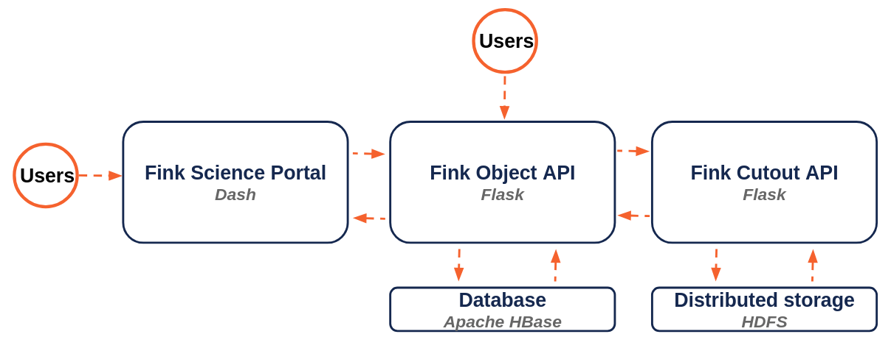

# Fink cutout API

[](https://github.com/astrolabsoftware/fink-cutout-api/actions?query=workflow%3ASentinel)



This API is used internally by Fink web components to retrieve cutouts from the data lake on HDFS. We take advantage of the pyarrow connector to read parquet files to efficiently extract required cutouts from an HDFS block.

## Requirements and installation

You will need Python installed (>=3.11) with requirements listed in `requirements.txt`. You wiil also need Hadoop installed on the machine, and Java 11 (at least). For the full installation and deployment, refer as to the [procedure](install/README.md).

## Usage

To deploy the API, you need access to the Fink HDFS cluster. Once `config.yml` is filled, just test using:

```bash
python app.py
```

In production, we deploy using gunicorn (see the [procedure](install/README.md)).

## Accessing 2D cutout

In Python, you can simply retrieve the 2D cutout stored in the alert using:

```python
import json
import requests

r = requests.post(
    "{}/api/v1/cutouts".format(URL),
    json={
        "hdfsPath": HDFS_PATH, 
        "kind": "Science", 
        "objectId": "ZTF24abssjsb",
        "return_type": "array"
    }
)

cutout = json.loads(r.content)[0]
```

Note that `HDFS_PATH` should be an URI relative to the user home folder on HDFS, e.g.:

```diff
- NO: hdfs://IP:PORT/user/toto/somefolder/myparquet.parquet
+ YES: somefolder/myparquet.parquet
```

If you choose `kind=All`, all 3 cutouts (`Science`, `Template`, `Difference` in that order) wil be returned.

## Original FITS

In addition to `array`, we support the `FITS` file format. Note that in this case, `kind` should be a single flavor (i.e. cannot be `All`).

You can easily retrieve the original FITS file stored in the alert from your terminal:

```bash
curl -H "Content-Type: application/json" \
    -X POST -d \
    '{"hdfsPath":HDFS_PATH, "objectId":"ZTF24abssjsb", "kind":"Science", "return_type": "FITS"}' \
    URL/api/v1/cutouts -o cutoutScience.fits
```

or in Python:

```python
import io
import requests
from astropy.io import fits

r = requests.post(
    "{}/api/v1/cutouts".format(URL),
    json={
        "hdfsPath": HDFS_PATH,
        "kind": "Science",
        "objectId": "ZTF24abssjsb",
        "return_type": "FITS"
    }
)

cutout = fits.open(io.BytesIO(r.content), ignore_missing_simple=True)
```

## Tests

Once the app is deployed (need credentials), simply trigger:

```bash
python tests/api_test.py URL
```

## Performances

For a single object, we obtain about 0.17 +/- 0.02 seconds for a single cutout, and 0.31 +/- 0.02 seconds for the 3 cutouts. Note it depends highly on the block size on HDFS. For ZTF, the block size in the datalake are about 100MB.
